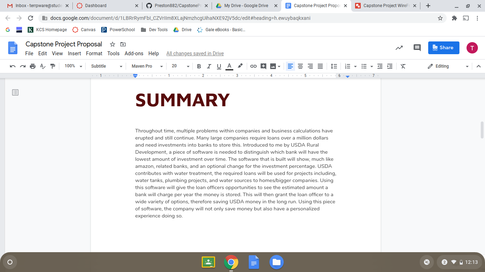
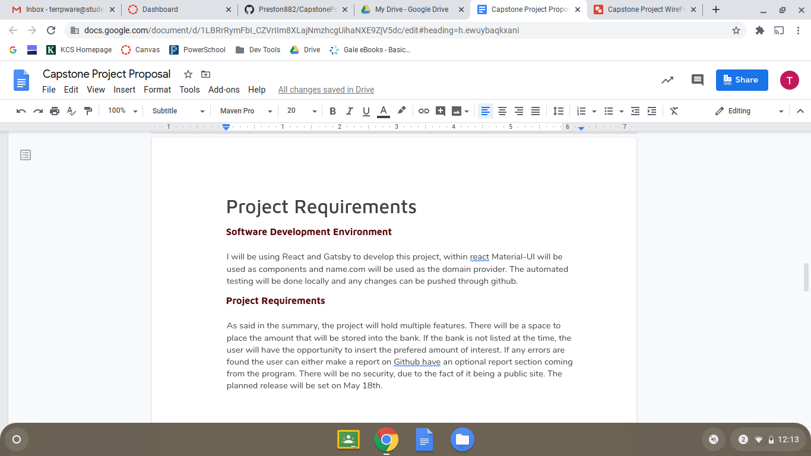
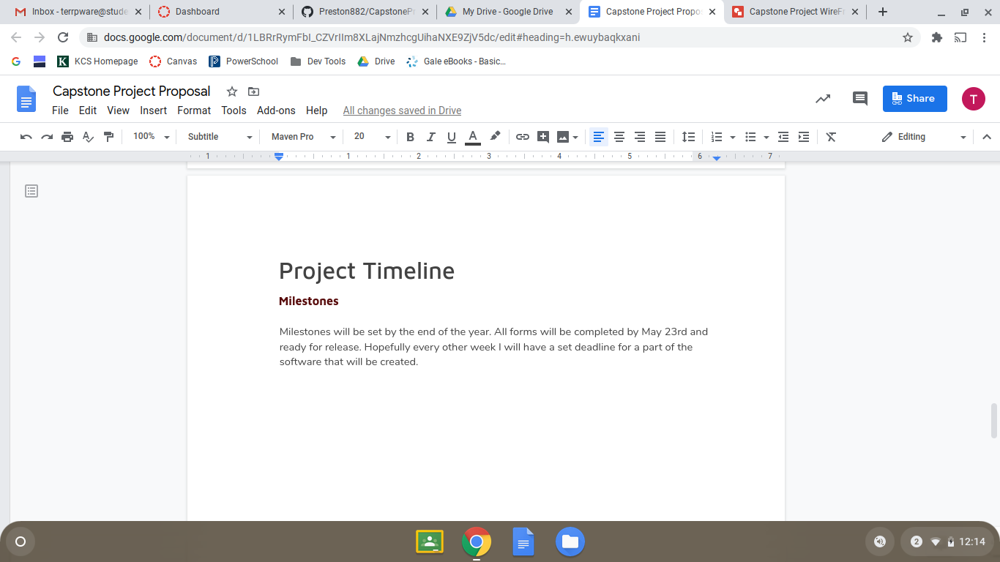
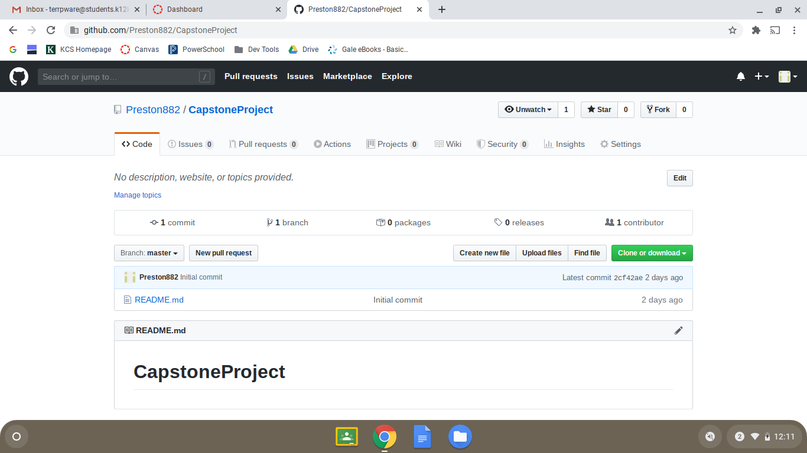
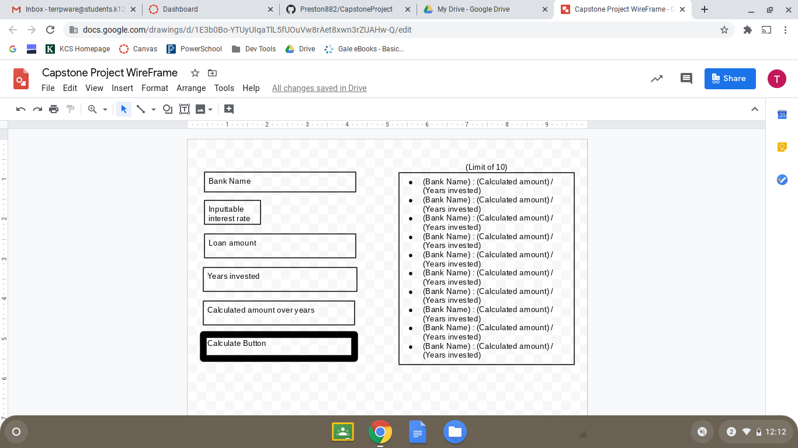

Throughout the time working as a remote worker from home during the 2020 Covid-19 Outbreak, I have enforced many tools I could potentially use in the future. As beginning my process with my Capstone Project, I will layout every step i take further and further to completion. As a starting process I created a plan for my project. The project is a loan calculator that saves the Banks, interest rates, and total amount. The next step in this process was to create a Project Proposal, as shown below:

The next step in this process was to create a [Github Repository](https://github.com/Preston882/CapstoneProject)

The final step for the day would be to create a WireFrame:

This is the first few steps required before development of a basic developer. This is just Part one of a very long process. Stay Tuned!