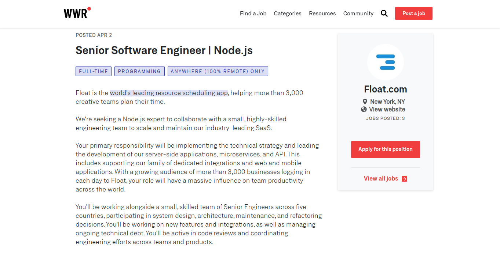
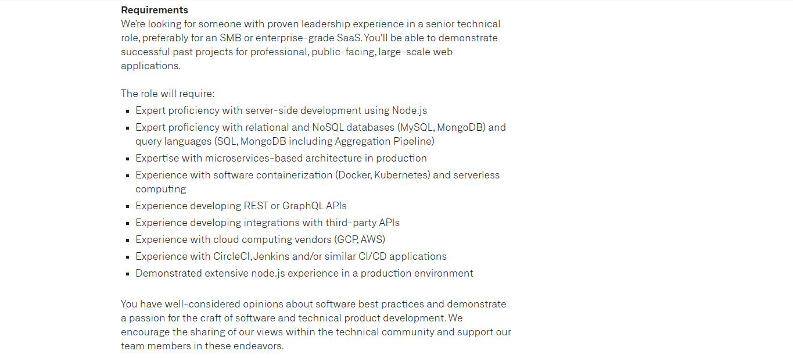

While looking for job posting I fourtunately enough didn't have to look very far. Right when I went on the site, I immediately found a Job from Float.com as a Senior Software Engineer. If you don't know about float.com it is the world's leading resource scheduling app, helping more than 3,000 creative teams plan their time. A snapshot of the post is below:

Some of the job requirements are:

Advantages of Remote work include more independent work and more online communication. Disadvantages include not having a person to person communication. My personal impression on remote work would seem fun, I'm excited to learn more about how to code from an individual standpoint and imputing my work remotely. Every day I learn more which increases my excitement and perseverance to learn more about the project at hand.

To conclude, remote work can be suitable for some people, however, could be a disadvantage for others. Depending on the working environment and the tools given to the developer, problems could either be resolved or persist.